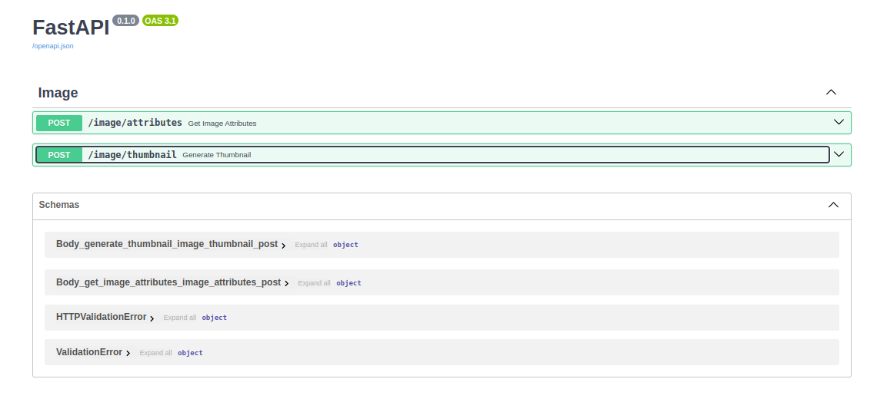
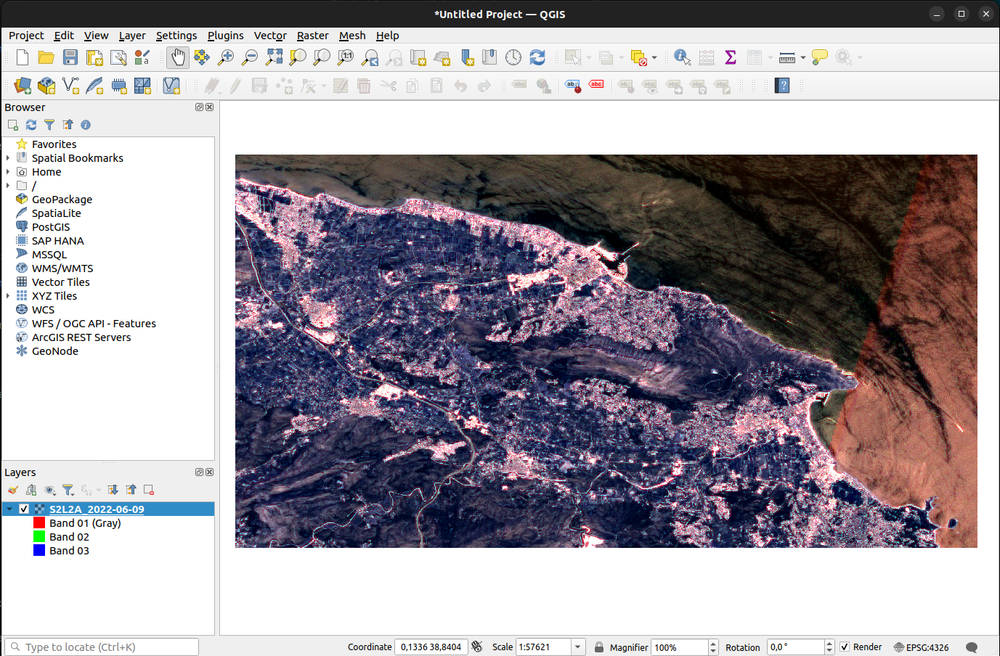

# FastAPI Geospatial Image Processing API

## Overview

This FastAPI application provides an API for processing satellite images. It includes functionalities to retrieve image attributes and generate thumbnails.

## Getting Started

### Prerequisites

- [Docker](https://www.docker.com/) (Or other container engine like Podman)
- [Python 3](https://www.python.org/downloads/)

### Installation

1. Clone the repository:

    ```bash
    git clone https://github.com/rcbop/python-geospatial.git
    cd python-geospatial
    ```

2. Install dependencies:

    ```bash
    pip install -r requirements.txt
    ```

### Running the Application

Run the FastAPI application using uvicorn:

```bash
python api/main.py
```

The API will be available at [http://127.0.0.1:8000](http://127.0.0.1:8000).

Environment variable `API_PORT` can be used to specify the port number. For example, to run the API on port 8080.

```bash
API_PORT=8080 python api/main.py
```

## Running with Docker Compose

1. Build the docker image:

    ```bash
    docker-compose build
    ```
2. Run the docker container:

    ```bash
    docker-compose up
    ```
3. The API will be available at [http://localhost:8000](http://localhost:8000).

## API Endpoints

### 1. Get Image Attributes

**Endpoint:** `POST /image/attributes`

This endpoint retrieves attributes of an uploaded image, such as size, number of bands, CRS, and georeferenced bounding box.

#### Request:

```bash
curl -X POST \
    -F "image=@/path/to/your/image.tif" \
    http://127.0.0.1:8000/image/attributes
```

#### Response:

```json
{
    "image_size": {
        "width": 1024,
        "height": 768
    },
    "number_of_bands": 3,
    "coordinate_reference_system": "EPSG:4326",
    "georeferenced_bounding_box": {
        "left": -180.0,
        "bottom": -90.0,
        "right": 180.0,
        "top": 90.0
    }
}
```

### 2. Generate Thumbnail

**Endpoint:** `POST /image/thumbnail`

This endpoint generates a thumbnail image from the uploaded satellite image.

#### Request:

```bash
curl -X POST \
    -F "image=@/path/to/your/image.tif" \
    -F "resolution=100" \
    http://127.0.0.1:8000/image/thumbnail \
    --output thumbnail.png
```

#### Response:

The generated thumbnail image will be saved as `thumbnail.png` in your current working directory.

## Dependencies

- [FastAPI](https://fastapi.tiangolo.com/)
- [uvicorn](https://www.uvicorn.org/)
- [rasterio](https://rasterio.readthedocs.io/)
- [Pillow (PIL)](https://pillow.readthedocs.io/)
- [Numpy](https://numpy.org/doc/stable/)
- [Python multipart](https://andrew-d.github.io/python-multipart/)

## Swagger

FastAPI provies a swagger docs endpoint at /docs. For example, if you are running the application locally, the swagger docs will be available at [http://localhost:8000/docs](http://localhost:8000/docs).



## Input image

This application expects a TIFF image as input.



## License

This project is licensed under the [MIT License](LICENSE).
